What is this?
=============

A {Neo}Vim plugin that generates in-place PlantUML diagrams right below their
sources. Those diagrams are placed in comment blocks and will be updated
correspondingly to their sources after each plugin run.

How to use?
===========

It's your job to install PlantUML and add it into your `PATH`.

Run `PlantUMLGenin` command to generate PlantUML diagrams in the active buffer.

```plantuml
@startuml

User -> Vim: run PlantUMLGenin command
Vim -> Plugin: the active buffer content
Plugin --> Vim: the content with diagrams
Vim -> Vim: update the active buffer content

/'
 ┌────┐                     ┌───┐                                ┌──────┐
 │User│                     │Vim│                                │Plugin│
 └─┬──┘                     └─┬─┘                                └──┬───┘
   │ run PlantUMLGenin command│                                     │    
   │ ─────────────────────────>                                     │    
   │                          │                                     │    
   │                          │      the active buffer content      │    
   │                          │ ────────────────────────────────────>    
   │                          │                                     │    
   │                          │      the content with diagrams      │    
   │                          │ <─ ─ ─ ─ ─ ─ ─ ─ ─ ─ ─ ─ ─ ─ ─ ─ ─ ─     
   │                          │                                     │    
   │                          │────┐                                     
   │                          │    │ update the active buffer content    
   │                          │<───┘                                     
 ┌─┴──┐                     ┌─┴─┐                                ┌──┴───┐
 │User│                     │Vim│                                │Plugin│
 └────┘                     └───┘                                └──────┘
'/
@enduml
```

Known issues
============

* Slow: PlantUML is slow, this plugin runs it synchronously on each source
block, so it's even more slower. Currently, there's no good way to fix this.
